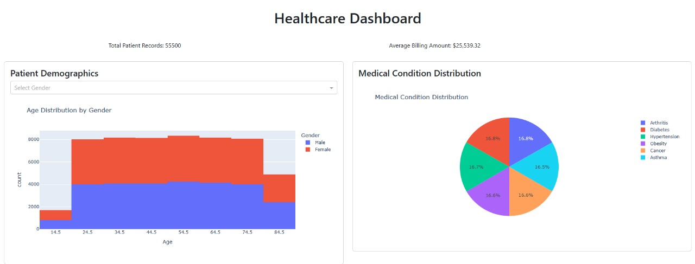

## 📊 Patient Healthcare Dashboard

An **Interactive Healthcare Dashboard** for analyzing hospital statistics, created with **Plotly Dash**. 

 

---

## 📌 About the Project
This dashboard provides a comprehensive view of hospital data, allowing you to analyze admission trends, patient distribution by medical condition, insurance provider comparison, and billing financial statistics.

### ✨ **Key Features**
✅ Overall patient and billing statistics 💰
✅ Interactive charts for demographic analysis 🏥
✅ Insurance provider comparison 🔍
✅ Hospital admission trends 📈
✅ Dynamic filters for custom segmentation 🎯

---
## 🚀 How to Run

### 📌 **Prerequisites**
Before starting, make sure you have installed:
- Python 3.8+
- `pip` (Python package manager)

### 📥 **Installation**
1️⃣ Clone this repository:
```bash
git clone https://github.com/your-user/Patient-Healthcare-Dashboard.git
cd Patient-Healthcare-Dashboard
```

2️⃣ Create a virtual environment (optional, but recommended):
```bash
python -m venv venv
source venv/bin/activate # Linux/Mac
venv\Scripts\activate # Windows
```

3️⃣ Install the dependencies:
```bash
pip install -r requirements.txt
```

4️⃣ Make sure the data file **`assets/healthcare.csv`** is in the correct directory. 

5️⃣ Run the application:
```bash
python app.py
```

6️⃣ Access the dashboard in the browser:
```
http://127.0.0.1:8050/
```
---

## 📂 Project Structure

```
Patient-Healthcare-Dashboard/
│── assets/ # Static files (CSS, images, CSV)
│ ├── healthcare.csv # Database with hospital information
│ ├── styles.css # Custom styles for the dashboard
│ ├── style.scss # Sass style file
│ ├── style.css.map # Sass generated style map
│── app.py # Main code for the Dashboard in Dash
│── requirements.txt # Project dependencies
│── README.md # Project documentation (this file)
```

---

## 🛠 Technologies Used

✅ **Python** - Main language of the project
✅ **Dash (Plotly Dash)** - Framework for creating interactive dashboards
✅ **Dash Bootstrap Components** - To improve dashboard design
✅ **Pandas** - Data manipulation and analysis
✅ **Plotly** - Interactive charts and data visualization

---


## 📌 Future Improvements 🚀
🔹 Export reports to PDF/Excel 📄
🔹 User authentication for personalized access 🔑
🔹 Integration with SQL/NoSQL databases 🔄
🔹 Performance optimization for large volumes of data ⚡

---

## 📜 License

This project is licensed under the **MIT License** - see the [`LICENSE`](LICENSE) file for more details.

---

## 🤝 Contribution

Contributions are welcome! To contribute:

1. Fork this repository

2. Create a branch (`git checkout -b my-new-feature`)

3. Commit your changes (`git commit -m 'Add new feature'`)

4. Push to the branch (`git push origin my-new-feature`)

5. Open a Pull Request 🚀

---

**Feito com ❤️ por [Luiz Ricardo Garcia](https://github.com/lricardogarcia).**  

